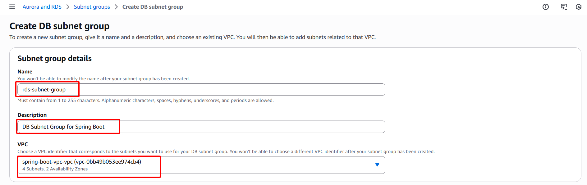

### 1.4. Create DB Subnet Group

1. **Go to Amazon RDS Console**: 
- Open: [https://console.aws.amazon.com/rds/](https://console.aws.amazon.com/rds/). 
- Select **Subnet groups** > **Create DB Subnet Group**.

2. **Configure DB Subnet Group**: 
- **Name**: `rds-subnet-group`. 
- **Description**: "DB Subnet Group for Spring Boot". 
- **VPC**: Select `spring-boot-vpc`. 

- **Add subnets**: Select 2 private subnets (eg: `spring-boot-vpc-private-us-east-1a`, `spring-boot-vpc-private-us-east-1b`).

- Click **Create**.

3. **Verify**:

- Check in **RDS Console** to make sure `rds-subnet-group` has been created with 2 private subnets.