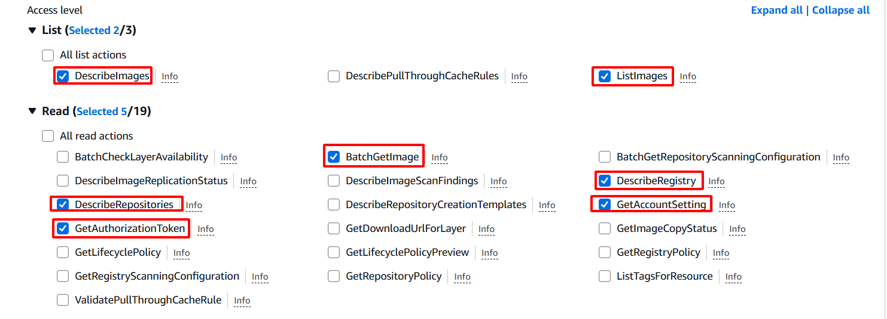
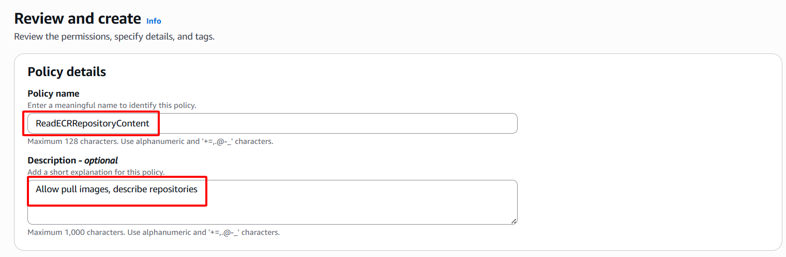
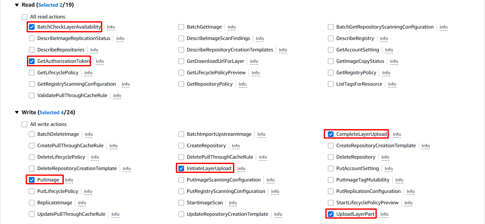
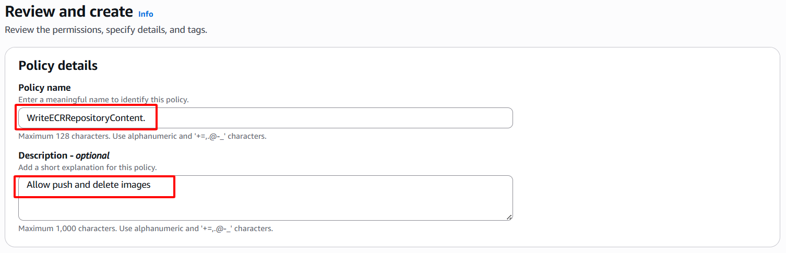
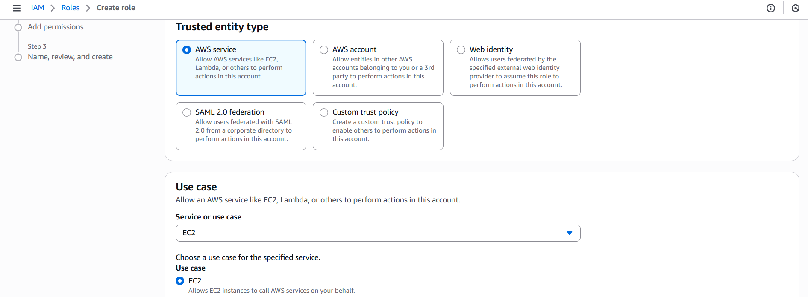
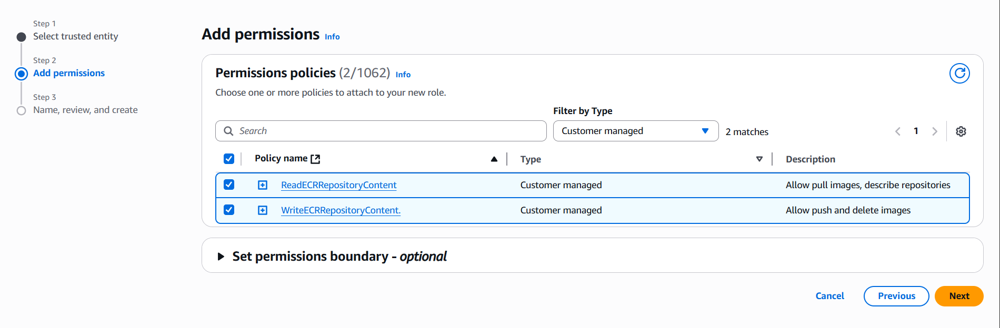

### 1.5. Create IAM Role for ECR

1. **Access IAM Console**: 
- Open: [https://console.aws.amazon.com/iam/](https://console.aws.amazon.com/iam/).

2. **Create an ECR Reading Policy**: 
- Select **Policies** > **Create Policy**. 
- Select the **Elastic Container Registry** service. 

- **Permissions**: 
- **List**: `DescribeImages`, `ListImages`. 
- **Read**: `BatchGetImage`, `DescribeRepositories`, `GetAuthorizationToken`, `GetAccountSetting`.

- **Resources**: Select **Any in this account**.

- **Policy name**: `ReadECRRepositoryContent`.
- **Description**: "Allow pulling images and viewing repository information".

- Click **Create policy**.

3. **Create ECR Record Policy**:
- Similarly, select **Elastic Container Registry**.
- **Permissions**:
- **Read**: `BatchCheckLayerAvailability`, `GetAuthorizationToken`.
- **Write**: `CompleteLayerUpload`, `InitiateLayerUpload`, `PutImage`, `UploadLayerPart`.
- **Resources**: Select **Any in this account**.
- **Policy name**: `WriteECRRepositoryContent`.

- **Description**: "Allow pushing and deleting images".
- Click **Create policy**.

4. **Create IAM Role**:

- Select **Roles** > **Create role** > **AWS service** > **EC2**.

- Attach 2 policies: `ReadECRRepositoryContent`, `WriteECRRepositoryContent`.

- **Role name**: `CustomRWECRRole`.
- **Description**: "Role allows reading and writing ECR".

- Click **Create role**.

5. **Verify**:

- Check in **IAM Console** to make sure the `CustomRWECRRole` role has been created and the correct policies have been attached.