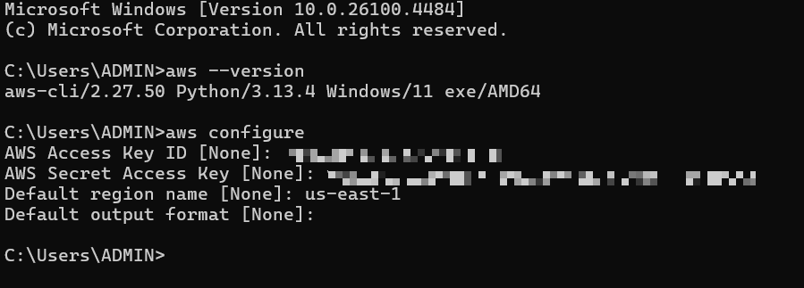

### 1.6. Install AWS CLI on Local Machine

1. **Download the installation file**:

- Go to: [https://awscli.amazonaws.com/AWSCLIV2.msi](https://awscli.amazonaws.com/AWSCLIV2.msi).

- Download the `AWSCLIV2.msi` file (for Windows) to the default folder (eg: `C:\Users\<YourUser>\Downloads`).

2. **Run the installer**:

- Find the `AWSCLIV2.msi` file, double-click to run.

- Follow the instructions:

- Click **Next** to continue.

- Accept the **License Agreement** and click **Next**.

- Keep the default installation directory (`C:\Program Files\Amazon\AWSCLIV2`) and click **Next**.

- Click **Install**, grant Administrator rights if requested.

- Click **Finish** to complete.

3. **Test the installation**:

- Open **Command Prompt** or **PowerShell** (Win + R, type `cmd` or `powershell`).

- Run:

```bash
aws --version
```
- Example output: `aws-cli/2.27.50 Python/3.13.4 Windows/11 exe/AMD64`.

- If the error `aws is not recognized` appears, check the PATH variable:

- Press Win + R, type `sysdm.cpl`, go to the **Advanced** tab > **Environment Variables**.

- In **System Variables**, find **Path**, add `C:\Program Files\Amazon\AWSCLIV2` if it is not there.

- Reopen Command Prompt/PowerShell and try again.

4. **AWS CLI Configuration**:

- Run:
```bash
aws configure
```
- Enter information:

- **AWS Access Key ID**: Get from AWS Management Console:

- Log in: [https://console.aws.amazon.com/iam/](https://console.aws.amazon.com/iam/).

- Go to **Users** > Select IAM user > **Security credentials** > **Create access key**.

- Select **Command Line Interface (CLI)**, load the CSV file containing the **Access Key ID** and **Secret Access Key**.


- **AWS Secret Access Key**: Import from CSV file.

- **Default region name**: Enter `us-east-1` (or the region of your choice).

- **Default output format**: Enter `json` or press Enter to use the default.

- The information is saved to:

- `C:\Users\<YourUser>\.aws\credentials`
- `C:\Users\<YourUser>\.aws\config`